<!-- 
# GreenMart UI & Validation Demo 🛒

A Flutter demo app showcasing **user authentication UI, input validation, and OTP verification**.  
This project focuses on clean and responsive design without full backend integration.

---

## 🖼️ Screenshots

<p float="left">
  
  
  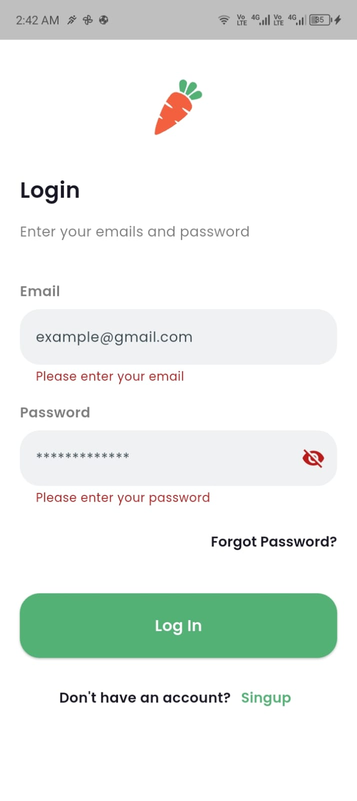
</p>

<p float="left">
  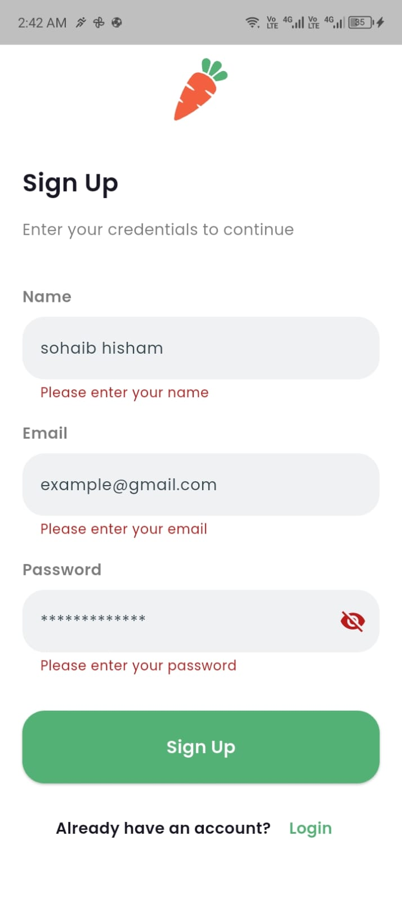
  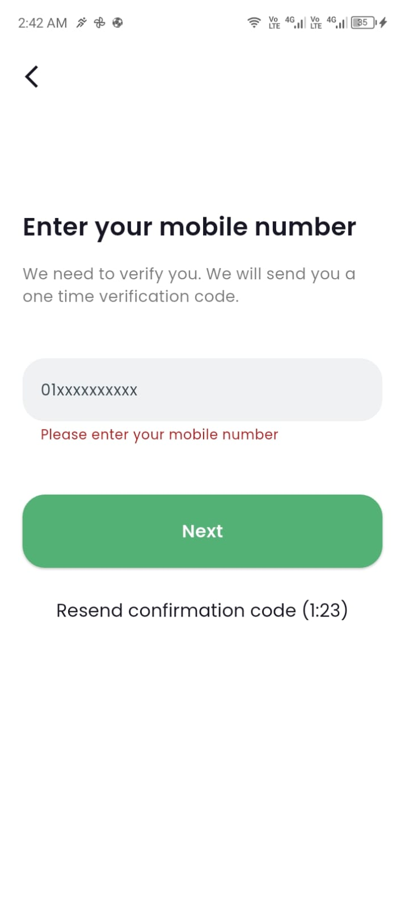
</p>

<p float="left">
  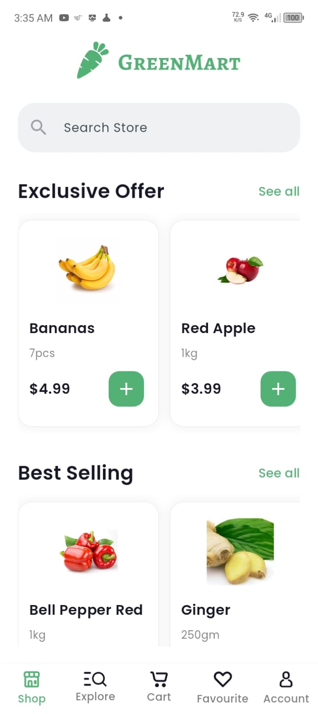
  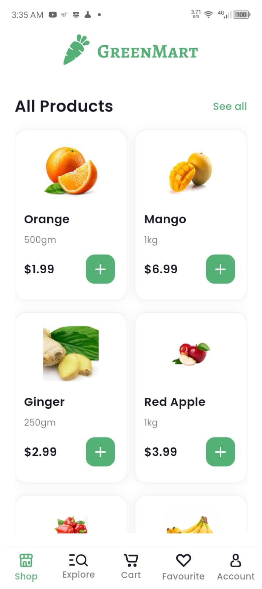
  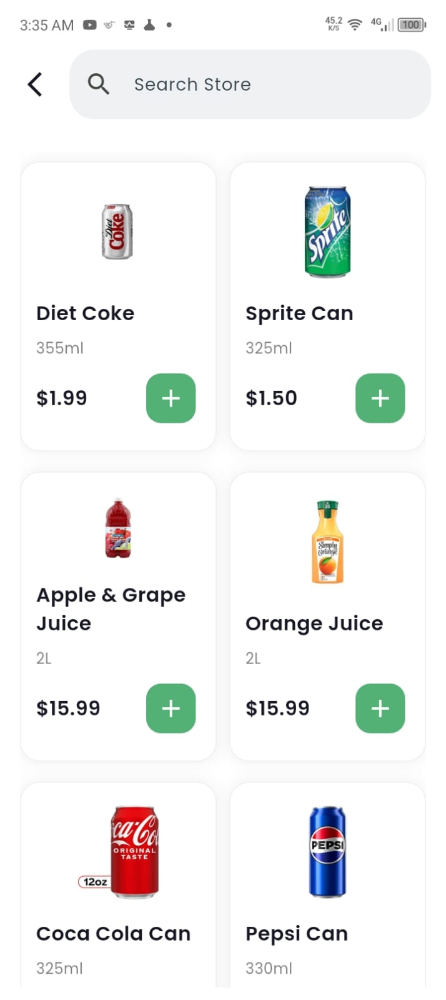
  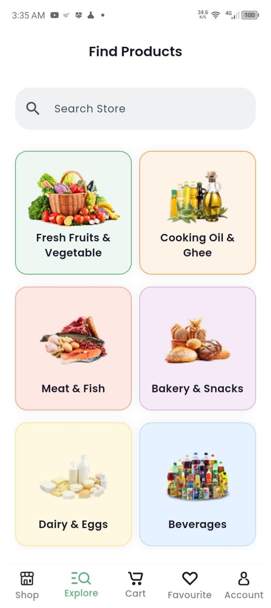
</p>

---

## 🚀 Features

* Splash and Welcome screens (UI only)  
* Login & Registration forms with validation  
* Mobile number input with validation  
* OTP input using **Pinput** widget  
* Navigation between screens  
* Clean, responsive, and reusable UI components  
* Additional UI screens: Home, Follow Home, Search, Explore  

---

## 📱 Screens

### 🔹 WelcomeScreen
* Intro UI before login

### 🔹 LoginScreen
* Email & password form  
* Input validation for empty fields

### 🔹 RegisterScreen
* Registration form with validation  
* CustomTextFormField usage

### 🔹 VerifyMobileScreen
* Enter mobile number for OTP  
* Form validation implemented

### 🔹 VerifyCodeScreen
* OTP input using **Pinput**  
* Validation and onCompleted callback  
* Navigation to next screen

### 🔹 HomeScreen
* Main content feed UI  
* Shows products and categories

### 🔹 FollowHomeScreen
* Followed stores or items feed  
* Displays updates from followed entities

### 🔹 SearchScreen
* Search bar and results  
* Filters and suggestions UI

### 🔹 ExploreScreen
* Explore new products, categories, or deals  
* Interactive UI for discovery

---

## 🛠️ Technologies Used

* Flutter  
* Dart  
* Material Design  
* [Pinput](https://pub.dev/packages/pinput) package for OTP UI

---

## 📦 Installation

1. Clone the repository:

```bash
git clone https://github.com/sohaib-khalifa/greenmart.git
cd greenmart -->
# GreenMart UI & Validation Demo 🛒

A Flutter demo app showcasing **user authentication UI, input validation, and OTP verification**.  
This project focuses on clean and responsive design without full backend integration.

---

## 🖼️ Screenshots

<p float="left">
  
  
  
</p>

<p float="left">
  
  
</p>

<p float="left">
  
  
</p>

<p float="left">
  
  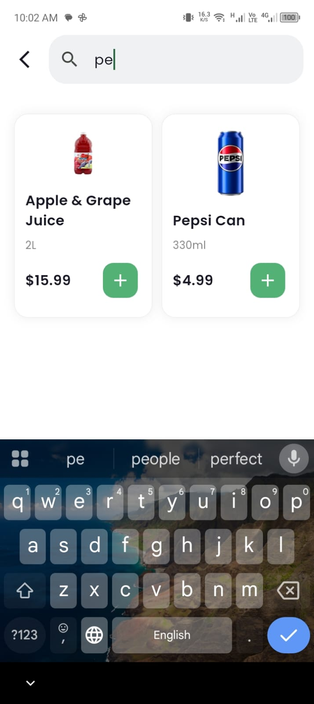
</p>

<p float="left">
  
  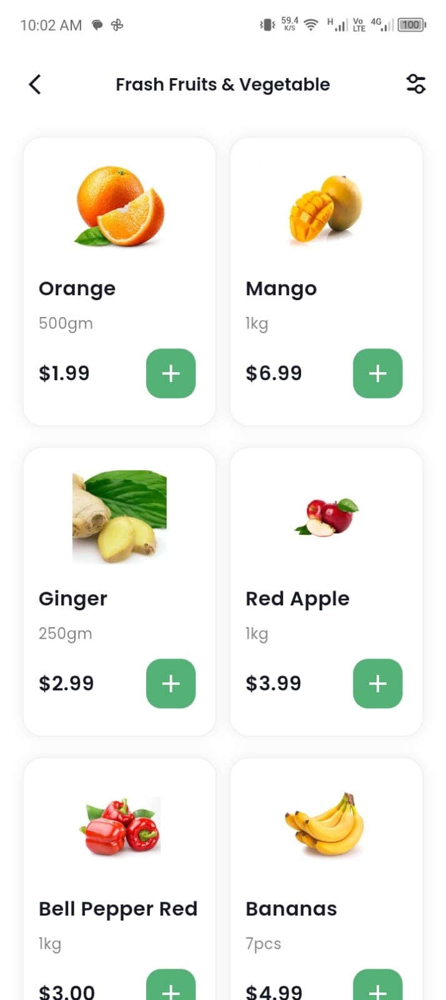
  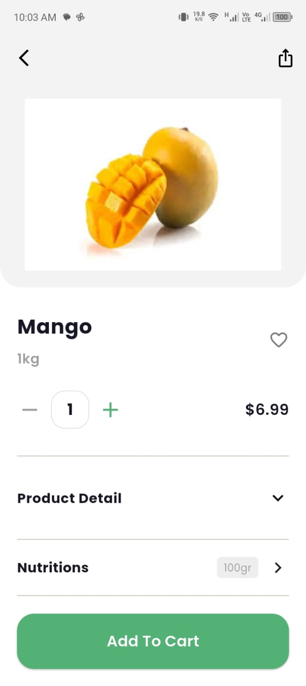
</p>

<p float="left">
  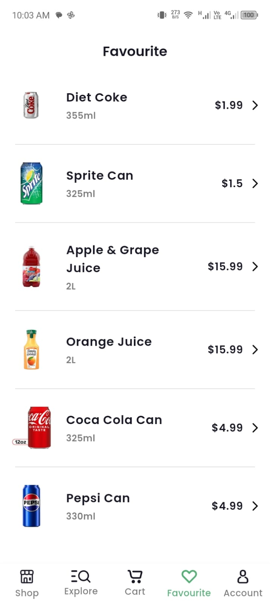
  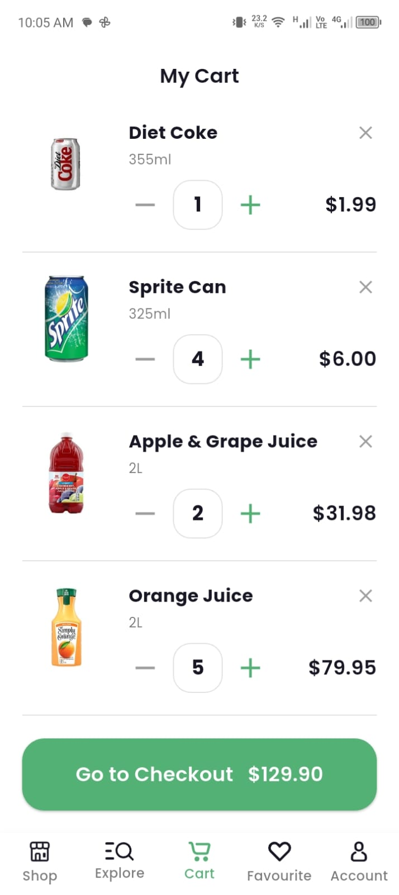
</p>

<p float="left">
  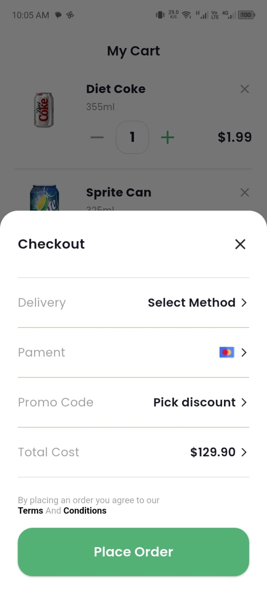
  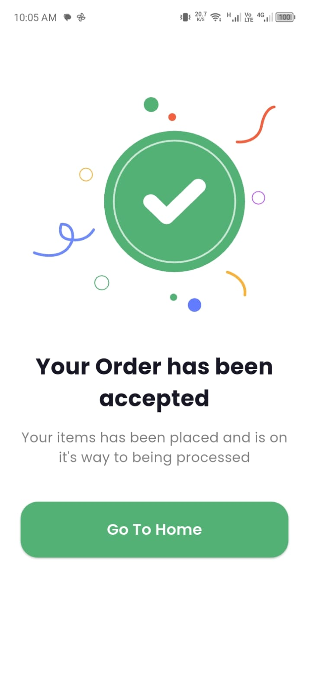
</p>

